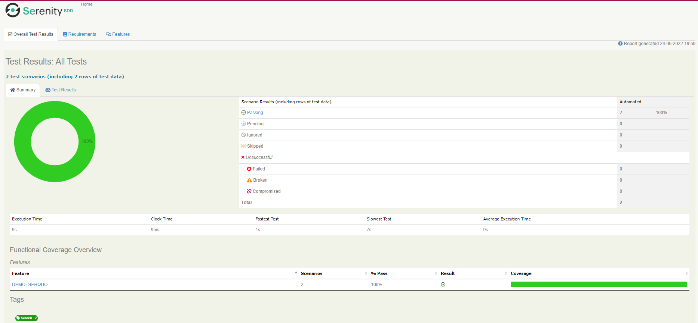

# Arquetipo_Cucumber
Este es un arquetipo para automatizar servicios con API REST. Esto se realizará con:
- Cucumber
- Serenity BDD
- Gradle

### Comenzando 🚀
Descargar el proyecto desde git

`git clone https://github.com/msh352/Arquetipo_Cucumber.git`

### Pre-requisitos 📋
Cosas que para arrancar el proyecto

`JDK 1.8`

### Ejecutando las pruebas ⚙️
Ejecutando las pruebas con IntelliJ IDEA como configurar el gradle run:
- Gradle projects:
- Tasks: la que tenemos configurada en build.gradle. En este caso **:test**
- Arguments: 
    - **-Dcucumber.filter.tags** : este argumento es para lanzar las tags que quieras. Si queremos lanzar el proyecto de DUCK seria @search y si queremos lanzar el de REQRES sería @reqres
    - **-Denv** : este argumento es para parametrizar por entorno. En esta prueba he dejado todas las URLs como si fuese PRO

`--tests "serenityRunners.TestRunner" -Dcucumber.filter.tags="@search" -Denv="PRO"`

o

`--tests "serenityRunners.TestRunner" -Dcucumber.filter.tags="@reqres" -Denv="PRO"
`

Tambien se puede lanzar por **linea de comandos** de esta forma:

`gradlew clean test aggregate -Dcucumber.options="src/test/resources/features -tags @search" -Denv="PRO"`

### Reportes 📖
Una vez ejecutado las pruebas, los reportes en Serenity serán guardados en:

`target/site/serenity/index.html`

